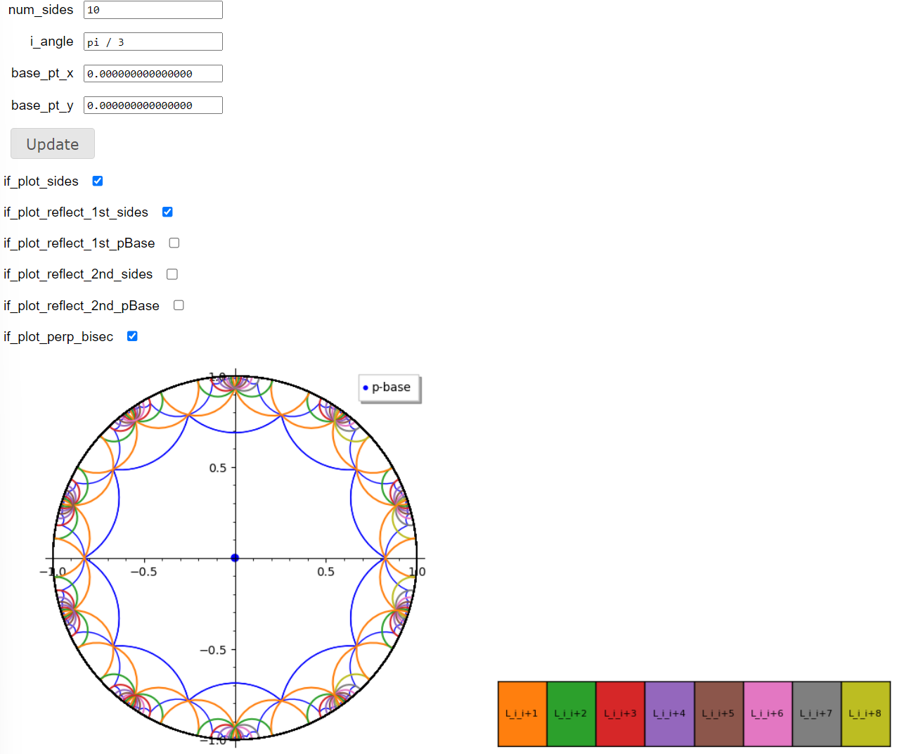

# sage-math-hyperbolic

### Background
This time, we implemented it using SageMath, a scientific computation library available in Python (programming language) that consists of a collection of pre-implemented functions.

### How to use it
When you open the URLs above, after waiting a bit, something like the image shown below will appear at the bottom of the page (the image is of the Coxeter 4-gon).
** At the top of the page, you'll find the script I wrote.
You should enter the values for the x, y coordinates of the Base-point and press Enter. Then, the script will run again, and the visualization will be updated.

### Demo
